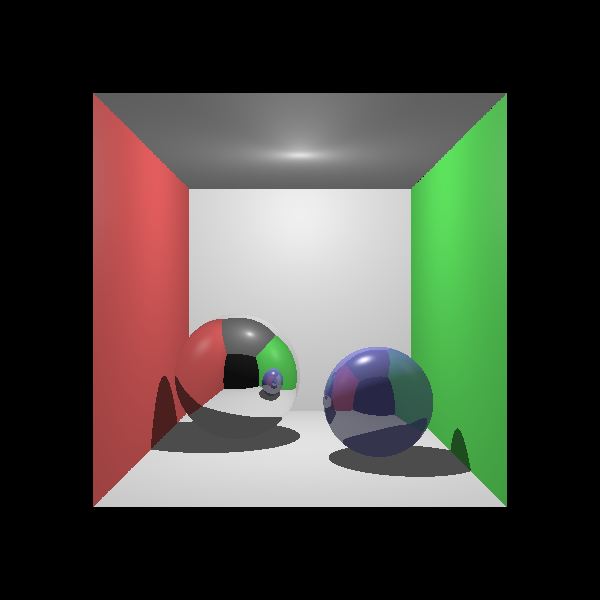
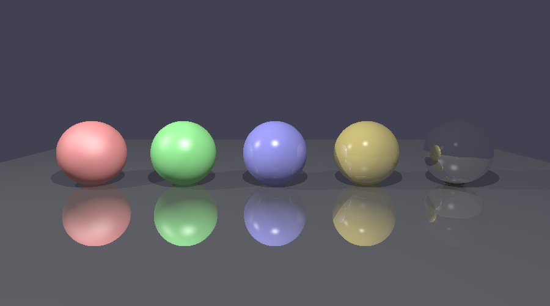
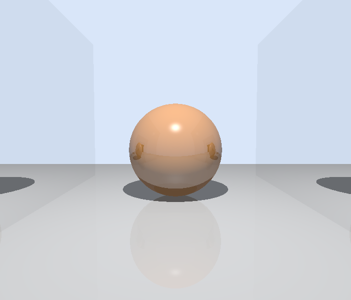
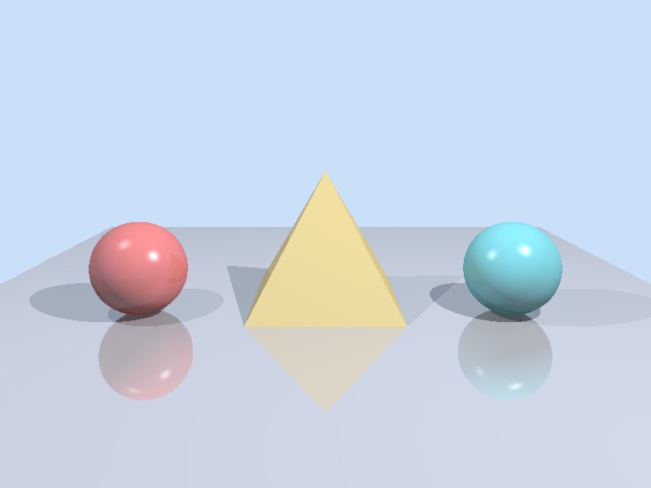
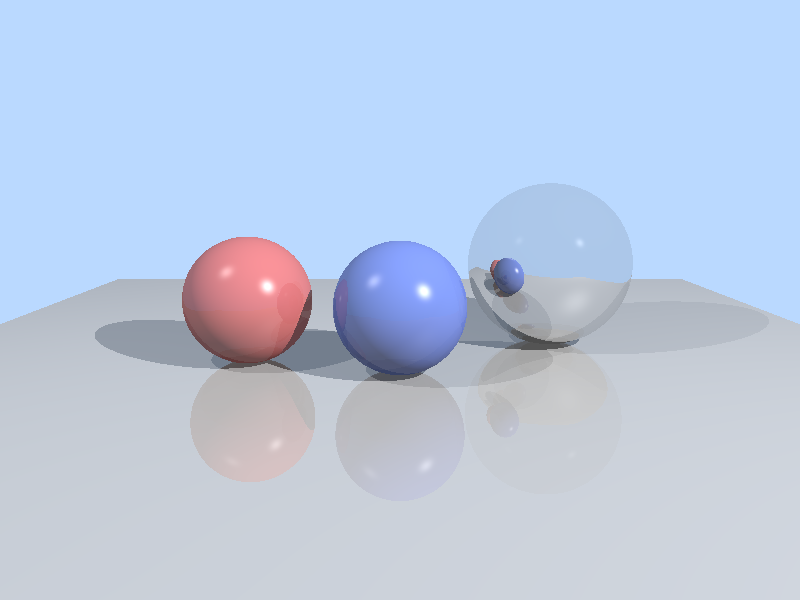
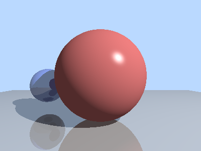

# cpplings

```
                                     _/  _/
        _/_/_/  _/_/_/    _/_/_/    _/      _/_/_/      _/_/_/    _/_/_/
     _/        _/    _/  _/    _/  _/  _/  _/    _/  _/    _/  _/_/
    _/        _/    _/  _/    _/  _/  _/  _/    _/  _/    _/      _/_/
     _/_/_/  _/_/_/    _/_/_/    _/  _/  _/    _/    _/_/_/  _/_/_/
            _/        _/                                _/
           _/        _/                            _/_/
```

[](https://en.wikipedia.org/wiki/C%2B%2B#Standardization)
[](https://opensource.org/licenses/MIT)
[](https://raw.githubusercontent.com/leissa/cpplings/refs/heads/master/tools/install.sh)

[Rustlings](https://rustlings.rust-lang.org/)-style exercises for learning modern C++, built on:
* [CMake](https://cmake.org/) for building
* [doctest](https://github.com/doctest/doctest) for testing
* Sanitizers enabled by default:
    * [Address Sanitizer](https://clang.llvm.org/docs/AddressSanitizer.html)
    * [Leak Sanitizer](https://clang.llvm.org/docs/LeakSanitizer.html)
    * [Undefined Behavior Sanitizer](https://clang.llvm.org/docs/UndefinedBehaviorSanitizer.html)

## Install

```sh
curl -fsSL https://raw.githubusercontent.com/leissa/cpplings/refs/heads/master/tools/install.sh | bash
```

## Start

```sh
cd cpplings
./cpplings
```

This walks you through the exercises one by one, watching your files for
changes and re-running them as you fix each one.

## Usage

```
usage: cpplings [-h] {list,run,verify,watch,watch-all} ...

positional arguments:
  {list,run,verify,watch,watch-all}
    list                List available exercises
    run                 Run a specific exercise
    verify              Verify all exercises
    watch               Watch a specific exercise
    watch-all           Watch all exercises (default)

options:
  -h, --help            show this help message and exit
```

## Final project: a ray tracer

The course concludes with a
[**ray tracer**](<https://en.wikipedia.org/wiki/Ray_tracing_(graphics)>)
([`exercises/05_capstone/P4_raytracer.cpp`](exercises/05_capstone/P4_raytracer.cpp)).
It renders 3D scenes of spheres and triangles into a PNG image, with
[Phong](https://en.wikipedia.org/wiki/Phong_reflection_model) lighting, shadows
and mirror reflections — pulling together classes, overloaded operators,
inheritance with virtual methods, `std::optional`, `std::unique_ptr` and
`std::vector`. See
[`exercises/05_capstone/README.md`](exercises/05_capstone/README.md) for details.

| | | |
| :---: | :---: | :---: |
|  |  |  |
| `cornell.txt` | `spheres.txt` | `mirrors.txt` |
|  |  |  |
| `pyramid.txt` | `example.txt` | `test.txt` |

## Credits

This tool follows the [*Modern C++ Programming*](https://federico-busato.github.io/Modern-CPP-Programming/) course by [Federico Busato](https://federico-busato.github.io/).
